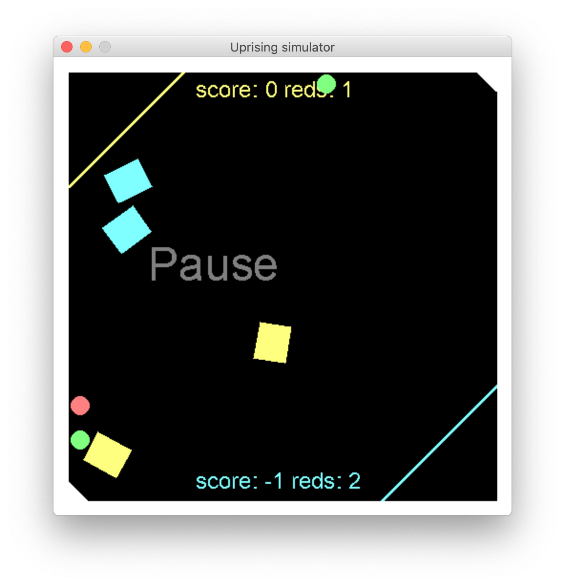
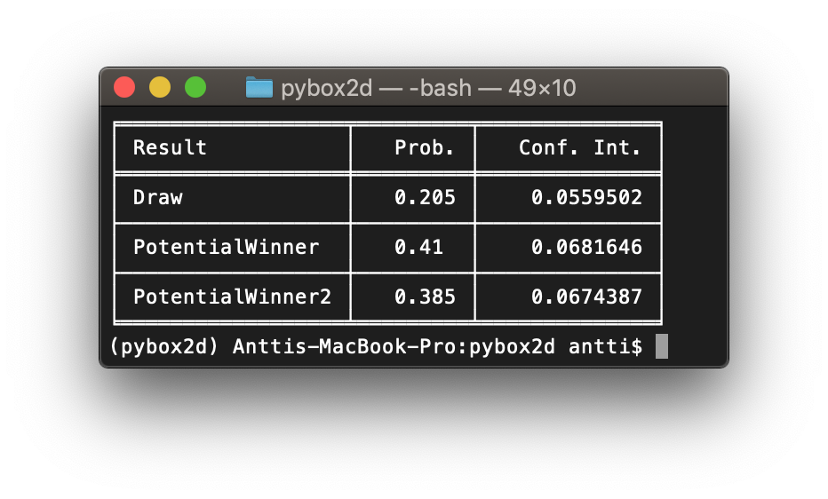

# uprising_simulator

Simulate the game played at RobotUprising hackathon

Two teams of robots (differential drive with tracks) compete in an arena,
their position and the position of energy cores (balls) are tracked from top using machine vision.

There are two bots per team, the objective is to push the red balls to opponents corner and
green balls to your own corner. If a player gets three green balls in their corner, they lose.
Otherwise the game ends as all the balls have been scored or after a time limit.
In this version the time limit is 30s, but in real game it would be 2m 30s.

Check the official [rules](https://github.com/robot-uprising-hq/ai-rules-mi2020).

In the bots.simple module there are couple of simple test programs to play against.
You can select "Human" as the player to control that bot with arrow keys.

Other controls:
- ESC Quit
- SPACE pause
- ENTER reset
- R toggle random core starting positions

Dependencies:
  - [pybox2d](https://github.com/pybox2d/pybox2d)
  - [pygame](https://www.pygame.org/)

# win_probabilities

A script that runs many simulated games from random startup configurations and computes how often each side wins.

Dependencies:
  - [pybox2d](https://github.com/pybox2d/pybox2d)
  - [tabulate](https://pypi.org/project/tabulate/)
  - [tqdm](https://pypi.org/project/tqdm/)